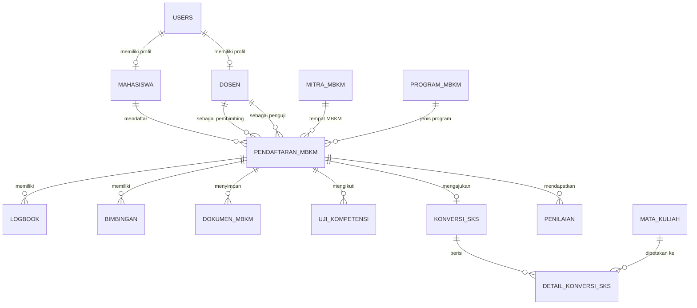

# Spec-Driven Backend: MBKM Prodi Ilmu Komputer

> Dokumen ini merupakan spesifikasi teknis untuk pengembangan backend aplikasi MBKM Prodi Ilkom, mencakup rancangan database, ERD, struktur model, dan rencana implementasi.

---

## 1. Latar Belakang & Tujuan

Aplikasi MBKM (Merdeka Belajar Kampus Merdeka) Prodi Ilmu Komputer adalah sistem untuk mengelola kegiatan mahasiswa yang mengikuti program MBKM. Sistem ini melibatkan empat aktor utama:

| Aktor             | Role      | Keterangan                                                   |
|-------------------|-----------|--------------------------------------------------------------|
| **Admin**         | admin     | Menyetujui akun mahasiswa baru, membuat akun Dosen & Kaprodi |
| Mahasiswa         | mahasiswa | Mendaftar, mengisi logbook, mengajukan konversi SKS          |
| Kaprodi           | kaprodi   | Menyetujui pendaftaran, assign pembimbing/penguji, penilaian |
| Dosen Pembimbing  | dosen     | Validasi logbook, bimbingan, penilaian                       |
| Dosen Penguji     | dosen     | Menilai uji kompetensi (proposal & laporan akhir)            |

---

## 2. Keputusan Desain

| # | Pertanyaan | Keputusan |
|---|---|---|
| 1 | Apakah Kaprodi adalah Dosen? | Tidak. Kaprodi hanya memiliki `role = 'kaprodi'` di tabel `users`. Tidak terhubung ke tabel `dosens`. |
| 2 | Apakah Dosen Pembimbing & Penguji dari tabel yang sama? | Ya. Keduanya adalah foreign key ke tabel `dosens`. |
| 3 | Apakah konversi SKS dilakukan per Mata Kuliah? | Ya. Mahasiswa memetakan setiap konversi ke `mata_kuliah` spesifik melalui tabel `detail_konversi_sks`. |
| 4 | Manajemen role menggunakan package atau enum? | Menggunakan kolom `role` enum sederhana di tabel `users`. Tidak menggunakan `spatie/laravel-permission`. |
| 5 | Siapa yang approve akun mahasiswa baru? | Admin. Akun mahasiswa yang baru register memiliki `is_active = false` secara default dan baru bisa login setelah diaktifkan oleh Admin. |
| 6 | Siapa yang membuat akun Dosen & Kaprodi? | Admin. Dosen Pembimbing, Dosen Penguji, dan Kaprodi tidak bisa register sendiri. Akun mereka dibuat langsung oleh Admin, dengan `is_active = true` sejak dibuat. |

---

## 3. Entity Relationship Diagram (ERD)



---

## 4. Spesifikasi Tabel Database

### 4.1 Tabel `users`
Tabel otentikasi utama. Semua aktor masuk dari tabel ini.

| Kolom              | Tipe          | Keterangan                             |
|--------------------|---------------|----------------------------------------|
| id                 | bigint PK     | Auto increment                         |
| name               | string        | Nama lengkap                           |
| email              | string unique | Email untuk login                      |
| email_verified_at  | timestamp     | Nullable                               |
| password           | string        | Hashed                                 |
| role               | enum          | `admin`, `kaprodi`, `mahasiswa`, `dosen` |
| is_active          | boolean       | Default `false`. Admin wajib mengaktifkan akun mahasiswa baru. Akun Dosen & Kaprodi dibuat langsung aktif (`true`) oleh Admin. |
| remember_token     | string        | Nullable                               |
| created_at         | timestamp     |                                        |
| updated_at         | timestamp     |                                        |

---

### 4.2 Tabel `mahasiswas`
Profil tambahan untuk aktor `mahasiswa`.

| Kolom    | Tipe      | Keterangan                   |
|----------|-----------|------------------------------|
| id       | bigint PK |                              |
| user_id  | bigint FK | → `users.id`                 |
| nim      | string unique | Nomor Induk Mahasiswa    |
| prodi    | string    | Program Studi                |
| angkatan | integer   | Tahun angkatan               |
| no_telp  | string    | Nullable                     |

---

### 4.3 Tabel `dosens`
Profil tambahan untuk aktor `dosen` (pembimbing & penguji).

| Kolom   | Tipe      | Keterangan       |
|---------|-----------|------------------|
| id      | bigint PK |                  |
| user_id | bigint FK | → `users.id`     |
| nip     | string unique | Nomor Induk Pegawai |
| no_telp | string    | Nullable         |

---

### 4.4 Tabel `mitra_mbkms`
Data master mitra/perusahaan tempat mahasiswa melakukan MBKM.

| Kolom               | Tipe      | Keterangan      |
|---------------------|-----------|-----------------|
| id                  | bigint PK |                 |
| nama_mitra          | string    |                 |
| bidang_usaha        | string    | Nullable        |
| alamat              | text      | Nullable        |
| narahubung          | string    | Nullable        |
| no_telp_narahubung  | string    | Nullable        |

---

### 4.5 Tabel `program_mbkms`
Data master jenis program MBKM (MSIB, Kampus Mengajar, Magang Mandiri, dll).

| Kolom        | Tipe      | Keterangan |
|--------------|-----------|------------|
| id           | bigint PK |            |
| nama_program | string    |            |
| deskripsi    | text      | Nullable   |

---

### 4.6 Tabel `mata_kuliahs`
Data master mata kuliah yang tersedia untuk konversi SKS.

| Kolom    | Tipe      | Keterangan               |
|----------|-----------|--------------------------|
| id       | bigint PK |                          |
| kode_mk  | string unique | Kode mata kuliah    |
| nama_mk  | string    | Nama mata kuliah         |
| sks      | integer   | Jumlah SKS               |
| semester | integer   | Semester pengambilan      |

---

### 4.7 Tabel `pendaftaran_mbkms` ⭐ (Tabel Pusat)
Tabel transaksi utama. Setiap row adalah satu pendaftaran MBKM dari seorang mahasiswa.

| Kolom                | Tipe      | Keterangan                                            |
|----------------------|-----------|-------------------------------------------------------|
| id                   | bigint PK |                                                       |
| mahasiswa_id         | bigint FK | → `mahasiswas.id`                                     |
| mitra_mbkm_id        | bigint FK | → `mitra_mbkms.id`                                    |
| program_mbkm_id      | bigint FK | → `program_mbkms.id`                                  |
| dosen_pembimbing_id  | bigint FK | → `dosens.id` (Nullable, diisi saat Kaprodi assign)   |
| dosen_penguji_id     | bigint FK | → `dosens.id` (Nullable, diisi saat Kaprodi assign)   |
| status               | enum      | `pending`, `disetujui`, `ditolak`, `berjalan`, `selesai` |
| tgl_mulai            | date      | Nullable                                              |
| tgl_selesai          | date      | Nullable                                              |

---

### 4.8 Tabel `logbooks`
Jurnal kegiatan harian mahasiswa selama MBKM.

| Kolom               | Tipe      | Keterangan                            |
|---------------------|-----------|---------------------------------------|
| id                  | bigint PK |                                       |
| pendaftaran_mbkm_id | bigint FK | → `pendaftaran_mbkms.id`              |
| tanggal             | date      |                                       |
| kegiatan            | text      | Deskripsi kegiatan                    |
| file_bukti          | string    | Path file bukti, Nullable             |
| status_validasi     | enum      | `pending`, `disetujui`, `revisi`      |

---

### 4.9 Tabel `bimbingans`
Catatan sesi bimbingan antara mahasiswa dan dosen pembimbing.

| Kolom               | Tipe      | Keterangan                        |
|---------------------|-----------|-----------------------------------|
| id                  | bigint PK |                                   |
| pendaftaran_mbkm_id | bigint FK | → `pendaftaran_mbkms.id`          |
| tanggal             | date      |                                   |
| catatan_mahasiswa   | text      | Nullable                          |
| catatan_dosen       | text      | Nullable, diisi dosen setelah bimbingan |
| status              | enum      | `menunggu`, `selesai`             |

---

### 4.10 Tabel `dokumen_mbkms`
Dokumen pendukung yang diupload terkait pendaftaran MBKM.

| Kolom               | Tipe      | Keterangan                                              |
|---------------------|-----------|---------------------------------------------------------|
| id                  | bigint PK |                                                         |
| pendaftaran_mbkm_id | bigint FK | → `pendaftaran_mbkms.id`                                |
| jenis_dokumen       | string    | Contoh: `surat_rekomendasi`, `sptjm`, `kontrak_magang` |
| file_path           | string    | Path file yang disimpan                                 |

---

### 4.11 Tabel `uji_kompetensis`
Data uji kompetensi (sidang proposal & laporan akhir) mahasiswa.

| Kolom               | Tipe      | Keterangan                                    |
|---------------------|-----------|-----------------------------------------------|
| id                  | bigint PK |                                               |
| pendaftaran_mbkm_id | bigint FK | → `pendaftaran_mbkms.id`                      |
| jenis_ujian         | enum      | `proposal`, `laporan_akhir`                   |
| tgl_ujian           | date      | Nullable                                      |
| nilai               | float     | Nullable, diisi setelah ujian                 |
| file_berkas         | string    | Nullable, path file berkas ujian              |
| status              | enum      | `menunggu`, `disetujui`, `revisi`, `selesai`  |

---

### 4.12 Tabel `konversi_sks`
Pengajuan konversi SKS dari mahasiswa setelah selesai MBKM.

| Kolom               | Tipe      | Keterangan                                     |
|---------------------|-----------|------------------------------------------------|
| id                  | bigint PK |                                                |
| pendaftaran_mbkm_id | bigint FK | → `pendaftaran_mbkms.id`                       |
| file_transkrip_mitra| string    | Nullable, transkrip nilai dari mitra            |
| status              | enum      | `pending`, `diproses`, `disetujui`, `ditolak`  |

---

### 4.13 Tabel `detail_konversi_sks`
Detail pemetaan konversi SKS ke Mata Kuliah yang spesifik.

| Kolom          | Tipe      | Keterangan                |
|----------------|-----------|---------------------------|
| id             | bigint PK |                           |
| konversi_sks_id| bigint FK | → `konversi_sks.id`       |
| mata_kuliah_id | bigint FK | → `mata_kuliahs.id`       |
| nilai_diakui   | float     | Nilai yang diakui, Nullable|

---

### 4.14 Tabel `penilaians`
Penilaian akhir dari masing-masing penilai.

| Kolom               | Tipe      | Keterangan                             |
|---------------------|-----------|----------------------------------------|
| id                  | bigint PK |                                        |
| pendaftaran_mbkm_id | bigint FK | → `pendaftaran_mbkms.id`               |
| jenis_penilai       | enum      | `pembimbing`, `penguji`, `mitra`       |
| nilai_total         | float     | Nullable                               |
| catatan             | text      | Nullable                               |

---

## 5. Eloquent Model Relationships

### `User`
```php
public function mahasiswa() { return $this->hasOne(Mahasiswa::class); }
public function dosen()     { return $this->hasOne(Dosen::class); }
```

### `Mahasiswa`
```php
public function user()           { return $this->belongsTo(User::class); }
public function pendaftaranMbkm(){ return $this->hasMany(PendaftaranMbkm::class); }
```

### `Dosen`
```php
public function user()                           { return $this->belongsTo(User::class); }
public function pendaftaranMbkmSebagaiPembimbing(){ return $this->hasMany(PendaftaranMbkm::class, 'dosen_pembimbing_id'); }
public function pendaftaranMbkmSebagaiPenguji()  { return $this->hasMany(PendaftaranMbkm::class, 'dosen_penguji_id'); }
```

### `PendaftaranMbkm`
```php
public function mahasiswa()      { return $this->belongsTo(Mahasiswa::class); }
public function mitraMbkm()      { return $this->belongsTo(MitraMbkm::class); }
public function programMbkm()    { return $this->belongsTo(ProgramMbkm::class); }
public function dosenPembimbing(){ return $this->belongsTo(Dosen::class, 'dosen_pembimbing_id'); }
public function dosenPenguji()   { return $this->belongsTo(Dosen::class, 'dosen_penguji_id'); }
public function logbooks()       { return $this->hasMany(Logbook::class); }
public function bimbingans()     { return $this->hasMany(Bimbingan::class); }
public function dokumenMbkms()   { return $this->hasMany(DokumenMbkm::class); }
public function ujiKompetensis() { return $this->hasMany(UjiKompetensi::class); }
public function konversiSks()    { return $this->hasOne(KonversiSks::class); }
public function penilaians()     { return $this->hasMany(Penilaian::class); }
```

### `KonversiSks`
```php
public function pendaftaranMbkm()    { return $this->belongsTo(PendaftaranMbkm::class); }
public function detailKonversiSks()  { return $this->hasMany(DetailKonversiSks::class); }
```

---

## 6. Alur Manajemen User (Admin)

### Registrasi Mahasiswa
```
[Mahasiswa Register] → is_active = false
    → (Admin login, lihat daftar akun pending)
    → (Admin klik "Aktifkan") → is_active = true
    → [Mahasiswa bisa login]
```

### Pembuatan Akun Dosen / Kaprodi
```
[Admin buka form "Buat Akun"]
    → Isi nama, email, role (dosen/kaprodi)
    → Sistem generate password sementara
    → is_active = true (langsung aktif)
    → [Dosen/Kaprodi bisa login dengan password sementara]
```

---

## 7. Status Alur Data (State Machine)

### `pendaftaran_mbkms.status`
```
[pending] → (Kaprodi approve) → [disetujui] → (MBKM berlangsung) → [berjalan] → (selesai) → [selesai]
         → (Kaprodi tolak) → [ditolak]
```

### `logbooks.status_validasi`
```
[pending] → (Dosen validasi) → [disetujui]
          → (Dosen minta revisi) → [revisi] → (Mahasiswa update) → [pending]
```

### `konversi_sks.status`
```
[pending] → (Kaprodi review) → [diproses] → (Kaprodi approve) → [disetujui]
                                           → (Kaprodi tolak) → [ditolak]
```

---

## 7. File Migrations yang Dihasilkan

| File Migration | Tabel |
|---|---|
| `0001_01_01_000000_create_users_table.php` | `users` |
| `2026_06_15_133604_create_dosens_table.php` | `dosens` |
| `2026_06_15_133604_create_mahasiswas_table.php` | `mahasiswas` |
| `2026_06_15_133604_create_mitra_mbkms_table.php` | `mitra_mbkms` |
| `2026_06_15_133605_create_mata_kuliahs_table.php` | `mata_kuliahs` |
| `2026_06_15_133605_create_program_mbkms_table.php` | `program_mbkms` |
| `2026_06_15_133606_create_pendaftaran_mbkms_table.php` | `pendaftaran_mbkms` |
| `2026_06_15_133607_create_bimbingans_table.php` | `bimbingans` |
| `2026_06_15_133607_create_dokumen_mbkms_table.php` | `dokumen_mbkms` |
| `2026_06_15_133607_create_logbooks_table.php` | `logbooks` |
| `2026_06_15_133607_create_uji_kompetensis_table.php` | `uji_kompetensis` |
| `2026_06_15_133608_create_konversi_sks_table.php` | `konversi_sks` |
| `2026_06_15_133608_create_penilaians_table.php` | `penilaians` |
| `2026_06_15_133609_create_detail_konversi_sks_table.php` | `detail_konversi_sks` |

---

## 8. Rencana Pengembangan Selanjutnya

- [ ] **Seeder** — Isi data awal: akun admin, kaprodi, beberapa dosen, mahasiswa dummy, serta data master MK & Program MBKM.
- [ ] **Backend Logic (Controllers)** — CRUD untuk pendaftaran, approval kaprodi, pengisian logbook, assignment dosen, penilaian.
- [ ] **Middleware Auth** — Guard berdasarkan `role` untuk membatasi akses route per aktor.
- [ ] **File Upload Handling** — Storage lokal atau cloud untuk dokumen, logbook, uji kompetensi.
- [ ] **Integrasi ke Views** — Menghubungkan data Eloquent dari Controller ke file `.blade.php` yang sudah ada.
